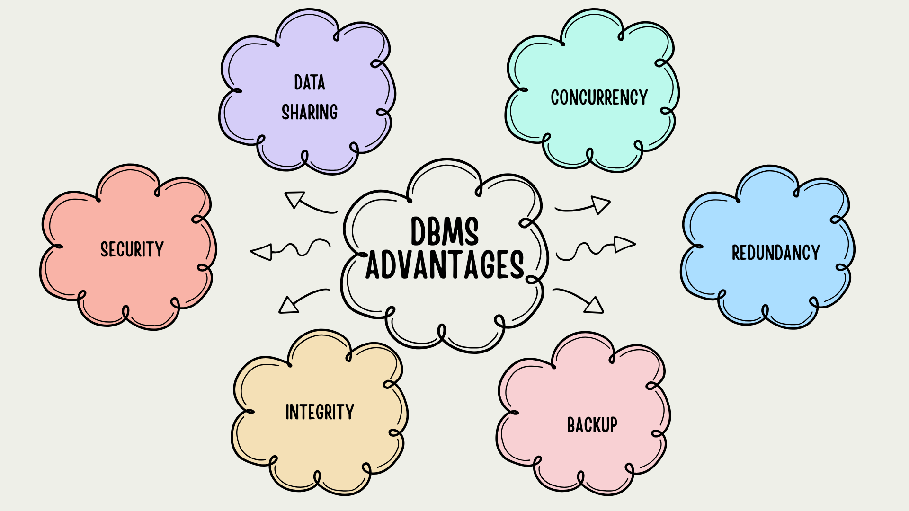

# Database Course Documentation

## 1. Flat File Systems vs. Relational Databases

| Feature           | Flat File System                                  | Relational Database                             |
|-------------------|---------------------------------------------------|-------------------------------------------------|
| **Structure**     | Data is stored in a single table or text file     | Data is stored in multiple related tables       |
| **Redundancy**    | High, same data may be repeated in many records   | Low, uses normalization to reduce redundancy    |
| **Relationships** | No relationships, manual linking between records  | Tables are linked using keys (Primary/Foreign)  |
| **Example Usage** | Storing logs, simple spreadsheets                 | Banking systems, inventory management, websites |
| **Drawbacks**     | Hard to search, no rules or constraints           | More complex to set up and manage               |

## 2. DBMS Advantages – Mind Map

Below is a mind map showing the key advantages of a Database Management System (DBMS):

### Description of Advantages:

- **Security** – Controls access and keeps data safe.
- **Integrity** – Ensures data is valid and consistent.
- **Backup** – Helps restore data after failure.
- **Redundancy** – Removes duplicate data.
- **Concurrency** – Allows many users at once.
- **Data Sharing** – Enables multiple users to access the same data.

## 3. Roles in a Database System
Here are the key roles in a typical database project:

### 1. System Analyst
- Understands the business needs.
- Collects requirements and communicates them to the technical team.
- Ensures the database system meets user needs.

### 2. Database Designer
- Designs the database structure (tables, relationships, constraints).
- Applies normalization to reduce redundancy.
- Creates Entity-Relationship Diagrams (ERDs).

### 3. Database Developer
- Writes SQL code (queries, procedures, triggers).
- Builds logic for interacting with the database.
- Works closely with designers and application developers.

### 4. Database Administrator (DBA)
- Maintains and monitors the database.
- Handles backups, recovery, performance tuning, and security.
- Ensures availability and smooth functioning.

### 5. Application Developer
- Creates applications that use the database (web, mobile, or desktop).
- Connects frontend interfaces to the database backend.
- Uses APIs or query languages to interact with the DB.

### 6. BI (Business Intelligence) Developer
- Analyzes large data sets for insights.
- Creates dashboards, reports, and visualizations.
- Uses tools like Power BI, Tableau, or SQL queries for data analysis.

## 4. Types of Databases

In this section, we explore different types of databases based on their structure and location.

---

### A. Relational vs. Non-Relational Databases

| Type              | Description                                                                 | Example Databases         | Best For                          |
|-------------------|-----------------------------------------------------------------------------|---------------------------|-----------------------------------|
| **Relational**     | Stores data in tables with rows and columns. Uses SQL for querying.         | MySQL, PostgreSQL, Oracle | Structured data, transactions     |
| **Non-Relational** | Stores data as key-value, document, or graph. More flexible, no fixed schema.| MongoDB, Cassandra, Redis | Big data, unstructured or flexible data |

---

### B. Centralized vs. Distributed vs. Cloud Databases

| Type               | Description                                                                     | Use Case Example                    |
|--------------------|---------------------------------------------------------------------------------|-------------------------------------|
| **Centralized**     | All data stored on a single server or location.                                 | School or hospital local DB         |
| **Distributed**     | Data spread across multiple locations or servers.                              | Global apps like Google or Netflix  |
| **Cloud Database**  | Hosted and managed online by cloud providers like AWS, Azure, or Google Cloud. | Scalable web apps, mobile apps      |

---

### C. Use Case Examples

- **Relational**: Banking, e-commerce, school management systems.
- **Non-Relational**: Real-time analytics, social media, chat applications.
- **Distributed**: Large-scale applications with global user base.
- **Cloud**: Startups or companies needing easy deployment and scaling.

## 5. Cloud Storage and Databases

Cloud storage and cloud-based databases have become popular due to flexibility, cost-efficiency, and scalability.

---

### What is Cloud Storage?

Cloud storage is a service that stores data online, allowing users to access and manage it from anywhere using the internet.  
It supports databases by:

- Storing backups and snapshots of data.
- Hosting large amounts of structured/unstructured data.
- Enabling distributed access for global applications.

---

### Advantages of Cloud Databases

| Advantage           | Description                                                                 |
|---------------------|-----------------------------------------------------------------------------|
| **Scalability**      | Easily handle more users or data with auto-scaling.                         |
| **Accessibility**    | Access the database from anywhere at any time.                              |
| **Managed Services** | Cloud providers handle updates, backups, and security.                      |
| **Cost-Effective**   | Pay only for what you use (no need for full server setup).                  |

**Examples:**  
- **Amazon RDS**  
- **Microsoft Azure SQL**  
- **Google Cloud Spanner**

---

### Disadvantages of Cloud Databases

| Disadvantage           | Description                                                             |
|------------------------|-------------------------------------------------------------------------|
| **Latency**            | Slower response times if the server is far away.                        |
| **Security Risks**     | Sensitive data stored online may face cyber threats.                    |
| **Vendor Lock-In**     | Switching providers can be difficult due to compatibility issues.       |
| **Ongoing Costs**      | Continuous payment required (can get expensive with large usage).  